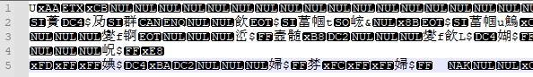
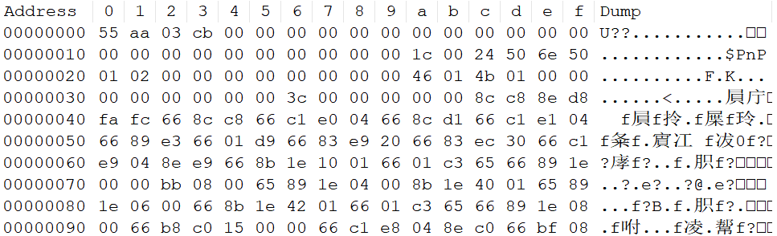

[TOC]

# MCU如何使用fopen fread fwrite fclose等函数？


**问题背景：**

很多开源库使用到了`fopen`、`fread`、`fwrite`、`fclosed`等函数，比如音视频压缩/解压缩算法，加解密算法等，通常是读入要处理的文件（使用`fread`），处理完成后，将处理后的数据存到新的文件（使用`fwrite`）。但简单的MCU运行的裸机代码一般并不支持文件系统，所以无法直接调用`fopen`、`fread`、`fwrite`、`fclose`这些函数。这时该怎么办？

常见的解决思路如下：

* **思路1：**修改代码中的`fopen`、`fread`、`fwrite`、`fclose`方法改造为直接操作数组；
* **思路2：**移植嵌入式文件系统，如使用FatFS，将文件存放到SDcard或Flash中，然后使用FatFs的`f_open`/`f_read`等对文件进行读写操作，硬件需要支持SDcard/Flash；
* **思路3：**Semihost功能，Semihost允许开发者从目标设备（即被开发的硬件平台）向主机（即开发者的计算机）发起请求服务，从而实现诸如文件I/O、打印输出等功能，需要编译器与调试器支持。

这篇只讲思路1的实现。

## 1 读写文件改为读写数组

**文件缓冲机制：**

读写文件属于IO操作，速度很慢，为了实现高效文件操作，文件系统采用缓冲机制，当通过 `fopen` 打开一个文件时，系统自动的在内存区为每个正在使用的文件开辟一个缓冲区（buffered stream）。意味着读写操作不是直接对磁盘进行，而是先与内存中的缓冲区交互。对于输出流，数据被写入到输出缓冲区中，直到缓冲区写满或显式刷新（如调用 `fflush`），此时数据才会从缓冲区被实际写入到文件。对于输入流，从文件读取的数据首先填充输入缓冲区，后续读取操作将从缓冲区中获取数据，直到缓冲区中的数据被读完时，才会再次从文件读取。

由此可见：文件的缓冲区和直接将文件转为数组形式，并没有什么本质区别，所以将读写文件改为操作数组的方式理论上是可行的。

**将文件转为C风格数组形式：**

C语言支持两种类型的文件，一种是文本文件（ASCII码文件），可以直接阅读的；一种是二进制流文件。ASCII文件本质上也是二进制文件（只是其内容是可打印字符），可以使用`xxd`命令将文件转为C风格的字节数组。

举例如下：test.bin是一个二进制文件。

直接用notepad记事本打开，是一堆乱码：



我们可以使用notepad的HEX-Editor插件查看（截取局部）：




使用`xxd`命令将文件转为C风格的字节数组：

~~~sh
# -i          output in C include file style.
# -c cols     format <cols> octets per line. Default 16 (-i: 12, -ps: 30).
$ xxd -i -c 16 test.bin > test.c
~~~

转换得到test.c的内容如下，与notepad查看的结果是一致的:

~~~c
unsigned char test_bin[] = {
  0x55, 0xaa, 0x03, 0xcb, 0x00, 0x00, 0x00, 0x00, 0x00, 0x00, 0x00, 0x00, 0x00, 0x00, 0x00, 0x00,
  0x00, 0x00, 0x00, 0x00, 0x00, 0x00, 0x00, 0x00, 0x00, 0x00, 0x1c, 0x00, 0x24, 0x50, 0x6e, 0x50,
  0x01, 0x02, 0x00, 0x00, 0x00, 0x00, 0x00, 0x00, 0x00, 0x00, 0x46, 0x01, 0x4b, 0x01, 0x00, 0x00,
  0x00, 0x00, 0x00, 0x00, 0x00, 0x00, 0x3c, 0x00, 0x00, 0x00, 0x00, 0x00, 0x8c, 0xc8, 0x8e, 0xd8,
  0xfa, 0xfc, 0x66, 0x8c, 0xc8, 0x66, 0xc1, 0xe0, 0x04, 0x66, 0x8c, 0xd1, 0x66, 0xc1, 0xe1, 0x04,
  0x66, 0x89, 0xe3, 0x66, 0x01, 0xd9, 0x66, 0x83, 0xe9, 0x20, 0x66, 0x83, 0xec, 0x30, 0x66, 0xc1,
  0xe9, 0x04, 0x8e, 0xe9, 0x66, 0x8b, 0x1e, 0x10, 0x01, 0x66, 0x01, 0xc3, 0x65, 0x66, 0x89, 0x1e,
  0x00, 0x00, 0xbb, 0x08, 0x00, 0x65, 0x89, 0x1e, 0x04, 0x00, 0x8b, 0x1e, 0x40, 0x01, 0x65, 0x89,
  0x1e, 0x06, 0x00, 0x66, 0x8b, 0x1e, 0x42, 0x01, 0x66, 0x01, 0xc3, 0x65, 0x66, 0x89, 0x1e, 0x08,
  0x00, 0x66, 0xb8, 0xc0, 0x15, 0x00, 0x00, 0x66, 0xc1, 0xe8, 0x04, 0x8e, 0xc0, 0x66, 0xbf, 0x08,
  0x00, 0x00, 0x00, 0x66, 0x31, 0xdb, 0xeb, 0x09, 0x66, 0x81, 0xfb, 0x80, 0x00, 0x00, 0x00, 0x74,
  ...
  ...
  0x00, 0x00, 0x00, 0x00, 0x00, 0x00, 0x00, 0x00, 0x00, 0x00, 0x00, 0x00, 0x00, 0x00, 0x00, 0x00,
  0x00, 0x00, 0x00, 0x00, 0x00, 0x00, 0x00, 0x00, 0x00, 0x00, 0x00, 0x00, 0x00, 0x00, 0x00, 0x00,
  0x00, 0x00, 0x00, 0x00, 0x00, 0x00, 0x00, 0x00, 0x00, 0x00, 0x00, 0x00, 0x00, 0x00, 0x00, 0x00,
  0x00, 0x00, 0x00, 0x00, 0x00, 0x00, 0x00, 0x00, 0x00, 0x00, 0x00, 0x00, 0x00, 0x00, 0x00, 0x00,
  0x00, 0x00, 0x00, 0x00, 0x00, 0x00, 0x00, 0x00, 0x00, 0x00, 0x00, 0x00, 0x00, 0x00, 0x00, 0x7b
};
unsigned int test_bin_len = 1536;
~~~


另外，ASCII文件也可以转换为C风格的字节数组，比如将test文本转换位C风格数组：

~~~sh
$ xxd -i test.txt > test.c
~~~

下面先列出标准的文件操作函数，然后列出对应改造后的函数。

## 2 文件操作函数

### 2.1 fopen()

打开文件，所有文件操作的第一步，都是使用`fopen()`打开指定文件。原型为：

~~~c
FILE* fopen(char* filename, char* mode);
~~~

入参：第一个参数是文件名(可以包含路径)，第二个参数是模式

返回值：FILE指针，其它函数可以用这个指针来操作文件。

FILE结构类型是在stdio.h中定义的，包含了如缓冲区位置，文件的状态以及文件当前位置等有关的文件信息。其具体定义形式如下：

~~~c
typedef struct {
    short          level;  /* fill/empty level of buffer */
    unsigned       flags;  /* file status flags */
    char           fd;     /* file descriptor */
    unsigned char  hold;   /* ungetc char if no buffer */
    short          bsize;  /* buffer size */
    unsigned char *buffer; /* data trasfer buffer */
    unsigned char *curp;   /* current active pointer */
    unsigned       istemp; /* temporary file indicator */
    unsigned       token;  /* used for validity checking */
    
} FILE;
~~~

`fopen()`使用示例：

~~~c
fp = fopen("hello.txt", "r");

if (fp == NULL) {
  printf("Can't open file!\n");
  exit(EXIT_FAILURE);
}
~~~

**改为数组形式：**

~~~c
MEMFILE* mem_fopen(char *buffer, size_t len)
{
  MEMFILE *fp = (MEMFILE *)malloc(sizeof(MEMFILE));

  fp->buffer = buffer;
  fp->bsize = len;
  fp->curpos = 0;

  return fp;
}
~~~

入参：第一个参数是文件转换得到的数组名，第二个参数是数组长度

返回值：MEMFILE指针，其它函数可以用这个指针来操作文件，定义在mem_fops.h中

~~~c
typedef struct {

  size_t bsize;           /* buffer size */
  unsigned char *buffer;  /* data trasfer buffer */
  size_t curpos;          /* current pos */

} MEMFILE;
~~~

### 2.2 fclose()

`fclose()`用来关闭已经使用`fopen()`打开的文件，原型为：

~~~c
int fclose(FILE* stream);
~~~

入参：接受一个文件指针`fp`作为参数

返回值：如果成功关闭文件，`fclose()`函数返回整数`0`；如果操作失败（比如磁盘已满，或者出现 I/O 错误），则返回一个特殊值 EOF

**改为数组形式：**

~~~c
int mem_fclose(MEMFILE *stream)
{
  if (stream == NULL)
    return 0;

  free(stream);
  stream = NULL;

  return 0;
}
~~~

### 2.3 fread()

`fread()`函数用于一次性从文件读取较大的数据块，用于从文件流中读取字节（byte）级别的数据放到数组中，原型为：

~~~c
size_t fread(
  void* ptr,
  size_t size,
  size_t nmemb,
  FILE* fp
);
~~~

入参：`ptr`：数组指针；`size`：每个数组成员的大小，单位为字节；`nmemb`：数组的成员数量；`fp`：文件指针

返回值：`fread()`函数的返回值是成功读取的数组成员的数量，正常情况下，该返回值就是第三个参数`nmemb`

`fread()`使用示例，读取100字节到数组上：

~~~c
#define BUFFER_SIZE 100

// 定义一个大小为 BUFFER_SIZE 的字符数组作为缓冲区
unsigned char buffer[BUFFER_SIZE];
int main() {

    size_t bytesRead;
    FILE *file;

    // 打开文件，以二进制读模式 ("rb")
    file = fopen("example.bin", "rb");
    if (file == NULL) {
        perror("Error opening file"); // 输出错误信息
        return EXIT_FAILURE;
    }

    // 使用 fread 读取最多 BUFFER_SIZE 字节的数据到缓冲区
    bytesRead = fread(buffer, sizeof(unsigned char), BUFFER_SIZE, file);
    if (bytesRead != BUFFER_SIZE) {
        printf("Warning: Read less bytes than expected. bytesRead = %d\n", bytesRead);
    }

    // 关闭文件
    fclose(file);

    return EXIT_SUCCESS;
}
~~~

**改为数组形式：**

~~~c
size_t mem_fread(void *buffer, size_t size, size_t count, MEMFILE *fp)
{
  if (fp == NULL || fp->buffer == NULL)
    return 0;

  size_t curpos = fp->curpos;
  unsigned char *pbuff = fp->buffer + curpos;
  size_t len = size * count;
  if (len > fp->bsize - curpos) {
    printf("fread overflow!\r\n");
    return 0;
  }

  for (size_t cnt = 0; cnt < len; cnt++) {
     *(unsigned char *)buffer++ = *pbuff++;
  }
  fp->curpos += len;

  return count;
}
~~~

### 2.4 fwrite()

`fwrite()`用来将数组数据写入文件。原型为：

~~~c
size_t fwrite(
  const void* ptr,
  size_t size,
  size_t nmemb,
  FILE* fp
);
~~~

入参：`ptr`：数组指针；`size`：每个数组成员的大小，单位为字节；`nmemb`：数组的成员数量；`fp`：文件指针

返回值：`fwrite()`函数的返回值是成功写入的数组成员的数量，正常情况下，该返回值就是第三个参数`nmemb`

`fwrite()`使用示例，写100字节到文件上：

~~~c
#define BUFFER_SIZE 100

// 定义一个大小为 BUFFER_SIZE 的字符数组作为缓冲区
unsigned char buffer[BUFFER_SIZE];

int main() {
    // 初始化缓冲区中的数据（例如，用递增的值填充）
    for (size_t i = 0; i < BUFFER_SIZE; ++i) {
        buffer[i] = (unsigned char)i; // 填充递增的字节值
    }

    FILE *file;

    // 打开或创建文件，以二进制写模式 ("wb")
    file = fopen("output.bin", "wb");
    if (file == NULL) {
        perror("Error opening/creating file"); // 输出错误信息
        return EXIT_FAILURE;
    }

    // 使用 fwrite 写入 BUFFER_SIZE 字节的数据到文件
    size_t bytesWritten = fwrite(buffer, sizeof(unsigned char), BUFFER_SIZE, file);

    // 检查是否写入了预期数量的字节
    if (bytesWritten != BUFFER_SIZE) {
        printf("Warning: Wrote less bytes than expected. bytesWritten = %d\n", bytesWritten);
    }

    // 关闭文件
    fclose(file);

    return EXIT_SUCCESS;
}
~~~

**改为数组形式：**

~~~c
size_t mem_fwrite(const void *buffer, size_t size, size_t count, MEMFILE *fp)
{
  if (fp == NULL || fp->buffer == NULL)
    return 0;

  size_t curpos = fp->curpos;
  unsigned char *pbuff = fp->buffer + curpos;
  size_t len = size * count;
  if (len > fp->bsize - curpos) {
    printf("fwrite overflow!\r\n");
    return 0;
  }

  for (size_t cnt = 0; cnt < len; cnt++) {
     *pbuff++ = *(unsigned char *)buffer++;
  }
  fp->curpos += len;

  return count;
}
~~~

### 2.5 fgetc()

`fgetc()`用于从文件读取一个字符。它们的用法跟`getchar()`类似，原型为:

~~~c
int fgetc(FILE *stream);
~~~

入参：`stream`：文件指针

返回值：返回的是一个字符，但返回值类型却不是`char`，而是`int`，这是因为读取失败的情况下，它们会返回 EOF，这个值一般是`-1`。

**改为数组形式：**

~~~c
int mem_fgetc(MEMFILE *stream)
{
 if (stream == NULL || stream->buffer == NULL)
    return -1;
  size_t curpos = stream->curpos;
  unsigned char *pbuff = stream->buffer + curpos;

  if (curpos >= stream->bsize) {
    printf("fgetc overflow!\r\n");
    return -1;
  }

  int ch = *pbuff;
  stream->curpos += 1;

  return ch;
}
~~~

### 2.6 fgets()

`fgets()`用于从文件读取指定长度的字符串，其原型为：

~~~c
char* fgets(char* str, int STRLEN, FILE* fp);
~~~

入参：第一个参数`str`是一个字符串指针，用于存放读取的内容。第二个参数`STRLEN`指定读取的长度，第三个参数是一个 FILE 指针，指向要读取的文件。

返回值：读取成功时，`fgets()`的返回值是它的第一个参数，即指向字符串的指针，否则返回空指针 NULL。

**改为数组形式：**

~~~c
char *mem_fgets(char *str, int num, MEMFILE *stream) {
  if (stream == NULL || stream->buffer == NULL || num <= 0 || str == NULL)
    return NULL;

  char *ptr = str;
  size_t remaining = num - 1;

  while (remaining > 0 && stream->curpos < stream->bsize) {
      unsigned char ch = stream->buffer[stream->curpos++];
      *ptr++ = ch;
      remaining--;

      if (ch == '\n') {
          break;
      }
  }

  *ptr = '\0';

  if (str == ptr) {
      return NULL;
  }

  return str;
}
~~~

### 2.7 fputc()

`fputc()`用于从文件读取一个字符。它们的用法跟`getchar()`类似，原型为:

~~~c
int fputc(FILE *stream);
~~~

入参：`stream`：文件指针

返回值：返回的是一个字符，但返回值类型却不是`char`，而是`int`，这是因为读取失败的情况下，它们会返回 EOF，这个值一般是`-1`。

**改为数组形式：**

~~~c
int mem_fputc(int c, MEMFILE *stream)
{
  if (stream == NULL || stream->buffer == NULL)
    return -1;

  size_t curpos = stream->curpos;
  unsigned char *pbuff = stream->buffer + curpos;
  if (curpos >= stream->bsize) {
    printf("fputc overflow!\r\n");
    return -1;
  }
  *pbuff = c;
  stream->curpos += 1;

  return c;
}
~~~

### 2.8 fputs()

`fputs()`函数用于向文件写入字符串，其原型为：

~~~c
int fputs(const char* str, FILE* stream);
~~~

入参：第一个参数是字符串指针，第二个参数是要写入的文件指针

返回值：入成功时，`fputs()`返回一个非负整数，否则返回 EOF

**改为数组形式：**

~~~c
int mem_fputs(const char *s, MEMFILE *stream) {
  if (stream == NULL || stream->buffer == NULL || s == NULL)
    return -1;

  size_t len = strlen(s);
  if (stream->curpos + len > stream->bsize) {
      len = stream->bsize - stream->curpos;
  }
  
  size_t curpos = stream->curpos;
  unsigned char *pbuff = stream->buffer + curpos;
  for (size_t cnt = 0; cnt < len; cnt++) {
     *pbuff++ = *s++;
  }
  stream->curpos += len;

  return 1;
}
~~~

###  2.9 fseek()

每个文件指针都有一个内部指示器（内部指针curp），记录当前打开的文件的读写位置（file position），即下一次读写从哪里开始。文件操作函数都从这个指示器指定的位置开始按顺序读写文件。

`fseek()`函数可以用来改变这个指示器。原型为：

~~~c
int fseek(FILE* stream, long int offset, int whence);
~~~

入参：`stream`：文件指针；`offset`：距离基准（第三个参数）的字节数。类型为 long int，可以为正值（向文件末尾移动）、负值（向文件开始处移动）或 0（保持不动）； `whence`：位置基准，用来确定计算起点。它的值是以下三个宏`SEEK_SET`（文件开始处）、`SEEK_CUR`（内部指针的当前位置）、`SEEK_END`（文件末尾）

返回值：正常情况下，`fseek()`的返回值为0。如果发生错误（如移动的距离超出文件的范围），返回值为非零值（比如`-1`)

`fseek()`使用示例：

~~~c
// 定位到文件开始处
fseek(fp, 0L, SEEK_SET);

// 定位到文件末尾
fseek(fp, 0L, SEEK_END);

// 从当前位置后移2个字节
fseek(fp, 2L, SEEK_CUR);

// 定位到文件第10个字节
fseek(fp, 10L, SEEK_SET);

// 定位到文件倒数第10个字节
fseek(fp, -10L, SEEK_END);
~~~

**改为数组形式：**

~~~c
int mem_fseek(MEMFILE* stream, long int offset, int whence)
{
  if (stream == NULL || stream->buffer == NULL)
    return -1;

  switch (whence) {
    case SEEK_SET:
      if (offset < 0 || offset > stream->bsize)
        return -1;
      stream->curpos = offset;
      break;
    case SEEK_CUR:
      if (stream->curpos + offset < 0 || (stream->curpos + offset) > stream->bsize) 
        return -1;
      stream->curpos += offset;
      break;
    case SEEK_END:
      if (offset > 0 || -offset > stream->curpos)
        return -1;
      stream->curpos = stream->bsize + offset;
      break;
    default:
      return -1;
  }

  return 0;
}
~~~

### 2.10 ftell()

`ftell()`函数返回文件内部指示器的当前位置，其原型为：

~~~c
long int ftell(FILE* stream);
~~~

入参：`stream`：文件指针

返回值：表示内部指示器的当前位置，即文件开始处到当前位置的字节数，`0`表示文件开始处。如果发生错误，`ftell()`返回`-1L`。

**改为数组形式：**

~~~c
long int mem_ftell(MEMFILE* stream)
{
  if (stream == NULL || stream->buffer == NULL)
    return -1;
 
  return stream->curpos;
}
~~~

### 2.11 rewind()

`rewind()`函数可以让文件的内部指示器回到文件开始处，其原型为：

~~~c
void rewind(FILE* stream);
~~~

入参：`stream`：文件指针

没有返回值

**改为数组形式：**

~~~c
void mem_rewind(MEMFILE* stream)
{
  if (stream == NULL || stream->buffer == NULL)
    return;
 
  stream->curpos = 0;
}
~~~

### 2.12 feof()

`feof()`函数判断文件的内部指针是否指向文件结尾，其原型为：

~~~c
int feof(FILE *fp);
~~~

入参：`stream`：文件指针

返回值：如果已经到达文件结尾，会返回一个非零值（表示 true），否则返回`0`（表示 false）。

**改为数组形式：**

~~~c
int mem_feof(MEMFILE* stream)
{
  if (stream == NULL || stream->buffer == NULL)
    return -1;
 
  size_t curpos = stream->curpos;
  if (curpos >= stream->bsize) {
    return 1;
  }
  
  return 0;
}
~~~

### 2.13 fprintf()

`fprintf()`用于向文件写入格式化字符串，用法与`printf()`类似。区别是`printf()`总是写入`stdout`，而`fprintf()`则是写入指定的文件。其原型为：

~~~c
int fprintf(FILE* stream, const char* format, ...);
~~~

使用 `fprintf()`可以替代`printf()`。

```
printf("Hello, world!\n");
fprintf(stdout, "Hello, world!\n");
```

`fprintf()`使用示例：

~~~c
fprintf(fp, "Sum: %d\n", sum);
~~~

**改为数组形式：**

~~~c
#include <stdarg.h>
int mem_fprintf(MEMFILE *stream, const char *format, ...)
{
  va_list ap;
  int ret = 0;
  
  if (stream == NULL || stream->buffer == NULL)
    return 0;
  size_t curpos = stream->curpos;
  unsigned char *pbuff = stream->buffer + curpos;

  va_start(ap, format);
  ret = vsprintf(pbuff, format, ap);
  va_end(ap);
  stream->curpos += ret;

  return ret;
}
~~~

### 2.14 fscanf()

`fscanf()`用于按照给定的模式，从文件中读取内容，用法跟`scanf()`类似。区别是`scanf()`总是从`stdin`读取数据，而`fscanf()`是从文件读入数据，其原型为：

~~~c
int fscanf(FILE* stream, const char* format, ...);
~~~

返回值：`fscanf()`的返回值是赋值成功的变量数量，如果赋值失败会返回 EOF。

**改为数组形式：**

**注意：**这里使用fgets()与sscanf()来代替fscanf()

~~~c
/* Note: need use newlibc */
#define BUFFER_SIZE 256
int mem_fscanf(MEMFILE *stream, const char *format, ...)
{

  va_list ap;
  
  if (stream == NULL || stream->buffer == NULL)
    return 0;

  char buffer[BUFFER_SIZE];
  if (mem_fgets(buffer, BUFFER_SIZE, stream) != NULL) {
    va_start(ap, format);
    vsscanf(buffer, format, ap);
    va_end(ap);
  }
  return 0;
}
~~~

## 3 单元测试

前面构造了几个函数，但是还需要进行简单的单元测试。

TODO：目前只加了一个单元测试用例，fwrite类似函数目前没有想到好的办法测试。

~~~sh
$ cd Tests
$ make
$ ./build/mem_fops_test
~~~

测试结果为：

~~~log
UnitTest.c:79:test_mem_fread:PASS

-----------------------
1 Tests 0 Failures 0 Ignored
OK
~~~


**参考：**

1. [Keil 5下STM32F103VE单片机通过C语言本身的fopen函数打开存储在W25Q128存储器中的文件](https://blog.csdn.net/ZLK1214/article/details/86634677)
2. [FatFs library extended for SDRAM](https://stm32f4-discovery.net/2015/05/fatfs-library-extended-for-sdram/)
3. [(85条消息) 【FatFs】手动移植FatFs，将SRAM虚拟U盘_ff_use_fastseek_喵喵锤锤你小可爱的博客-CSDN博客](https://blog.csdn.net/qq_42820594/article/details/125892537)
4. [(85条消息) FATFS系列之移植篇-存储介质外部SRAM_JasonComing的博客-CSDN博客](https://blog.csdn.net/JasonTD/article/details/106355521)
5. [Create and populate FAT32 filesystem without mounting it](https://unix.stackexchange.com/questions/629492/create-and-populate-fat32-filesystem-without-mounting-it)
6. [ld链接文件分析及一次bug解决过程](https://blog.csdn.net/QQ576494799/article/details/124164914)
7. https://wangdoc.com/clang/file
8. [fprintf函数 C语言 | 标准维基](https://www.standards.wiki/c/c_library_stdio_function_fprintf.html)